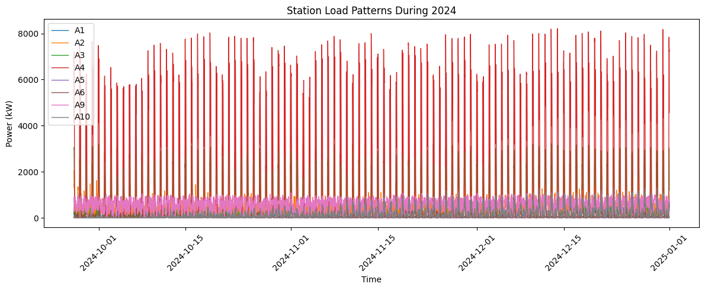
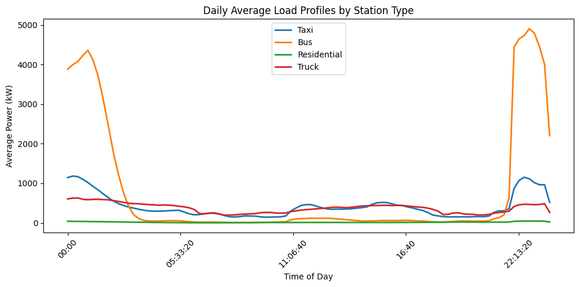
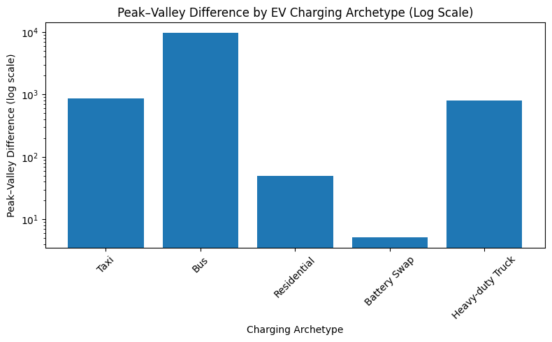
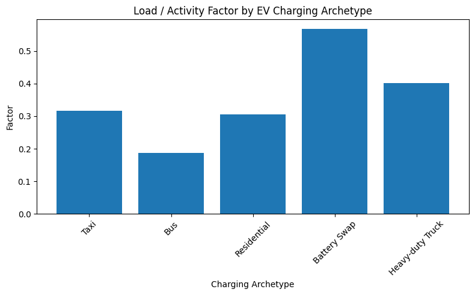
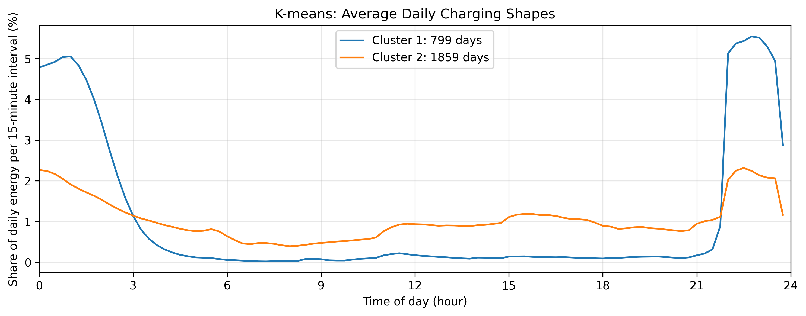
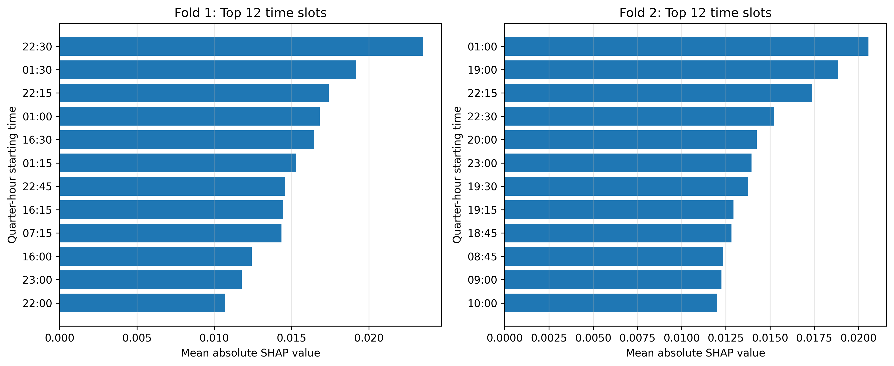
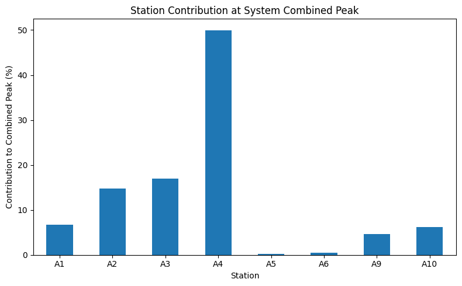

# MP-EVData: Electric Vehicle Charging Load Analysis

## Project Overview

This project performs a reproducible analysis of electric vehicle (EV) charging load profiles using the MP-EVData dataset.

The objective is to characterize charging behaviors of different EV charging station archetypes, identify daily charging patterns, evaluate load characteristics, classify station categories using machine learning, interpret model decisions, and analyze charging system interactions.

The analysis includes:

- Data acquisition and documentation
- Data preprocessing and quality assessment
- Station-level and time-level feature extraction
- EV charging load profile analysis
- Peak–valley difference and load factor analysis
- Daily charging pattern clustering
- Machine learning based station classification
- SHAP-based model interpretation
- Charging simultaneity analysis
- Time-of-use (TOU) price response analysis


---

# Dataset

**Dataset:** MP-EVData  
**Source:** Scientific Data (2026)  
**Location:** One Chinese city  
**Study Year:** 2024  
**Time Resolution:** 15 minutes  


## Station Archetypes

The dataset contains five EV charging station archetypes:

- Taxi charging stations
- Bus charging stations
- Residential charging stations
- Battery swap stations
- Heavy-duty truck charging stations


---

# Project Structure

```
MP_EVData_Project/

├── README.md

├── notebooks/
│   └── 01_MP_EVData_Reproducible_Analysis.ipynb

├── data/
│   └── Raw dataset files (not included)

├── results/
│   ├── kmeans_results/
│   ├── rf_shap_results/
│   ├── simultaneity_results/
│   ├── peak_valley_load_factor_results/
│   └── tou_price_response_results/

├── report/
│   └── figures_used/

├── figures/

└── downloaded_zips/
    └── Original dataset archives
```

---

# Research Workflow

The complete analysis workflow follows:

1. Dataset acquisition and organization
2. Data quality assessment and preprocessing
3. Station-level and time-level feature extraction
4. EV charging load curve analysis
5. Peak–valley difference and load factor evaluation
6. Charging pattern clustering using K-means
7. Station type classification using Random Forest
8. SHAP-based model interpretation
9. Charging simultaneity evaluation
10. Time-of-use price response analysis


---

# Methodology


## 1. Data Quality Assessment

Data validation includes:

- Timestamp checking
- Missing interval detection
- Year coverage verification
- Station data consistency checks


---

## 2. Load Profile Analysis

The charging profiles were analyzed using:

- Annual station load curves
- Average daily charging curves
- Station archetype comparisons
- Peak demand characteristics


---

## 3. Peak–Valley Difference and Load Factor Analysis

To evaluate charging load fluctuation and utilization characteristics, the following indicators were calculated:


### Peak–Valley Difference

Peak–valley difference represents the difference between maximum and minimum charging load.

It evaluates the fluctuation intensity of charging demand.


### Load Factor

Load factor is calculated as the ratio between average load and peak load.

It represents charging load utilization efficiency.


Analysis was performed for different EV charging archetypes:

- Taxi
- Bus
- Residential
- Battery swap
- Heavy-duty truck


Outputs:

- Peak–valley difference comparison
- Load factor comparison


---

## 4. Charging Pattern Clustering

Applied:

**K-means clustering**

to identify representative daily charging behaviors.


Outputs:

- Daily charging shape clusters
- Cluster distribution
- Representative charging profiles


---

## 5. Station Type Classification

Implemented:

**Random Forest classifier**

to classify EV charging stations based on extracted load features.


Evaluation includes:

- Classification performance
- Confusion matrix
- Feature importance analysis


---

## 6. Model Interpretation

Applied:

**SHAP (SHapley Additive exPlanations)**

to interpret machine learning decisions.

SHAP analysis identifies important charging behavior features influencing station classification.


---

## 7. Charging Simultaneity Analysis

The simultaneity analysis evaluates interaction between station loads.

Calculated:

- Individual station peak loads
- Combined system peak load
- Simultaneity coefficient
- Station contribution to system peak demand


---

## 8. Time-of-Use (TOU) Price Response Analysis

Evaluated potential charging response under time-of-use electricity pricing scenarios.

Analysis includes:

- TOU period identification
- Energy concentration during pricing periods
- Charging behavior comparison


---

# Key Results

The project provides:

- EV station charging behavior characterization
- Daily charging pattern identification
- Peak demand and utilization analysis
- Charging archetype classification using machine learning
- SHAP-based interpretation of classification results
- System-level simultaneity evaluation
- TOU charging response assessment


---

# Visualization Results


## 1. Station Load Patterns




## 2. Station Type Comparison




## 3. Peak–Valley Difference Analysis




## 4. Load Factor Analysis




## 5. K-means Charging Pattern Clusters




## 6. Random Forest SHAP Feature Importance




## 7. Simultaneity Analysis




---

# Reproducibility

All analysis steps are implemented in:

```
notebooks/01_MP_EVData_Reproducible_Analysis.ipynb
```


The notebook contains:

- Data loading
- Data cleaning
- Feature generation
- Statistical analysis
- Machine learning models
- Visualization generation


---

# Software Environment

Main tools:

- Python
- Pandas
- NumPy
- Matplotlib
- Scikit-learn
- SHAP
- Jupyter Notebook


---

# Outputs

Generated figures:

```
report/figures_used/
```


Analysis tables and model outputs:

```
results/
```


---

# Author

Research project in:

**Management Science & Engineering**


Focus areas:

- Electric Vehicle Charging Systems
- Energy Data Analytics
- Machine Learning
- Sustainable Transportation
